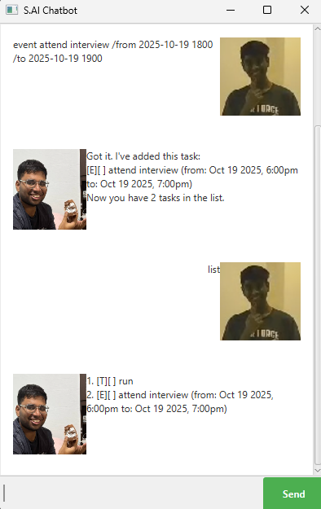

# S.AI User Guide

> information_source: S.AI is a lightweight, offline task assistant with a friendly chat-style interface. Add todos, deadlines, and events; search, mark, unmark, and delete tasks; and have everything saved locally.


## Introduction
S.AI is a desktop task manager for students and busy professionals who prefer typing to clicking. Instead of juggling buttons and menus, you simply tell S.AI what you need in natural, compact commands. Your tasks are stored on your computer in a human‑readable file, so you stay in control without accounts or internet.

- **Who it’s for**: keyboard‑driven users who want a minimal, fast, and private task tool.
- **What you get**: quick task entry, date parsing, instant search, persistent storage, and a clean JavaFX UI.
- **Why it’s helpful**: no setup beyond Java 17; your data lives in `data/sai.txt`; and the command set is easy to learn.


## Quick start

### Prerequisites
- Java Development Kit (JDK) 17
- Windows/Mac/Linux (JavaFX 17 is bundled via Gradle dependencies)

### Install
1. Download or clone this repository.
2. Open a terminal in the project root.

### Run (development)
- Windows:
  ```bash
  .\gradlew.bat run
  ```
- macOS/Linux:
  ```bash
  ./gradlew run
  ```
S.AI launches in a window titled "S.AI Chatbot".

### Build a runnable JAR
- Windows:
  ```bash
  .\gradlew.bat shadowJar
  ```
- macOS/Linux:
  ```bash
  ./gradlew shadowJar
  ```
The fat JAR is produced at `build/libs/duke.jar`.

Run the JAR:
```bash
java -jar build/libs/duke.jar
```

### First look


- The left pane shows a scrolling chat.
- Type commands at the bottom and press Enter.
- S.AI replies in the chat with confirmations or results.


## Features

### General notes
- Commands are case‑insensitive: `LIST`, `List`, and `list` are treated the same.
- Indexes shown in lists start at 1.
- Dates accept several formats (see below). If only a date is given, time defaults to 23:59.

Supported date/time input formats:
- `yyyy-MM-dd HHmm`  (e.g., `2025-12-02 1800`)
- `yyyy-MM-dd`  (e.g., `2025-12-02`)
- `d/M/yyyy HHmm`  (e.g., `2/12/2025 1800`)
- `d/M/yyyy`  (e.g., `2/12/2025`)

:bulb: Tip: Keep descriptions concise; you can always search with `find`.

---

### List tasks
- **Format**: `list`
- **Example**: `list`
- **What happens**: Shows all tasks in order with their indexes.

---

### Add a todo
- **Format**: `todo DESCRIPTION`
- **Example**: `todo read book`
- **What happens**: Adds a plain task with no date/time.

---

### Add a deadline
- **Format**: `deadline DESCRIPTION /by DATE_OR_DATETIME`
- **Examples**:
  - `deadline return book /by 2025-12-02`
  - `deadline submit report /by 2025-12-02 1800`
  - `deadline pay bills /by 2/12/2025 1800`
- **What happens**: Adds a task with a due date/time.

:information_source: If you specify only a date (no time), it’s stored as 23:59 of that day.

---

### Add an event
- **Format**: `event DESCRIPTION /from START_DATE_OR_DATETIME /to END_DATE_OR_DATETIME`
- **Examples**:
  - `event project meeting /from 2025-12-02 1000 /to 2025-12-02 1200`
  - `event conference /from 2/12/2025 /to 3/12/2025`
- **What happens**: Adds an event with start and end.

:exclamation: Ensure `/to` appears after `/from`, and both dates are valid.

---

### Mark a task as done
- **Format**: `mark INDEX`
- **Example**: `mark 2`
- **What happens**: Marks the listed task as completed.

---

### Mark a task as not done
- **Format**: `unmark INDEX`
- **Example**: `unmark 2`
- **What happens**: Marks the listed task as not completed.

---

### Delete a task
- **Format**: `delete INDEX`
- **Example**: `delete 3`
- **What happens**: Removes the task and shows the updated count.

---

### Find tasks by keyword
- **Format**: `find KEYWORD`
- **Examples**:
  - `find book`
  - `find project`
- **What happens**: Lists tasks whose descriptions contain the keyword (substring match).

:bulb: Search is case‑insensitive because S.AI lower‑cases commands internally; keep keywords simple.

---

### Exit the app
- **Format**: `bye`
- **What happens**: S.AI says goodbye; close the window to exit.


## Data storage
- Tasks are saved to `data/sai.txt` in your project working directory.
- Storage format per line:
  - Todo: `T | isDone | description`
  - Deadline: `D | isDone | description | by`
  - Event: `E | isDone | description | start | end`
- The file and folder are created automatically if missing.


## FAQ
- **Do I need the internet?**
  - No. Everything runs locally and stores to `data/sai.txt`.
- **What Java version do I need?**
  - JDK 17.
- **Why does a date fail to parse?**
  - Use one of the supported formats listed above. If parsing fails, S.AI returns an error message indicating acceptable formats.
- **How do duplicates work?**
  - S.AI prevents adding exact duplicates of existing tasks (same description and same date/time where applicable).

## Command summary

| Command | Format | Example |
| --- | --- | --- |
| List | `list` | `list` |
| Add todo | `todo DESCRIPTION` | `todo read book` |
| Add deadline | `deadline DESCRIPTION /by DATE_OR_DATETIME` | `deadline return book /by 2025-12-02 1800` |
| Add event | `event DESCRIPTION /from START /to END` | `event project meeting /from 2025-12-02 1000 /to 2025-12-02 1200` |
| Mark done | `mark INDEX` | `mark 2` |
| Mark not done | `unmark INDEX` | `unmark 2` |
| Delete | `delete INDEX` | `delete 3` |
| Find | `find KEYWORD` | `find book` |
| Exit | `bye` | `bye` |

